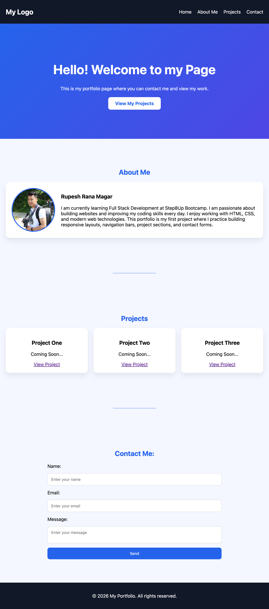

# My First Portfolio Project 2026

## Description

This project is a responsive personal portfolio website built using HTML and CSS. The website introduces who I am, showcases my learning journey in web development, and provides sections for projects and contact information.

### Motivation
My motivation for building this project was to practice front-end web development and improve my skills in creating responsive and structured web pages.

### Why I Built This Project
I built this portfolio to gain hands-on experience with HTML, CSS, semantic page structure, responsive layouts, navigation systems, and GitHub deployment workflows.

### Problem It Solves
This project creates a clean and organized online portfolio where users can learn about me, explore future projects, and contact me easily.

### What I Learned
Through this project, I learned:

- Semantic HTML structure
- CSS styling and layout design
- Responsive web design principles
- Navigation and page linking
- Image handling and folder organization
- Git and GitHub workflows
- Deploying websites with GitHub Pages

---

## Table of Contents

- [Installation](#installation)
- [Usage](#usage)
- [Features](#features)
- [Credits](#credits)
- [License](#license)
- [Badges](#badges)
- [How to Contribute](#how-to-contribute)
- [Tests](#tests)

---

## Installation

To run this project locally:

1. Clone the repository:

```bash
git clone https://github.com/rrana5106/my-first-portfolio-project-2026.git
```

2. Navigate to the project folder:

```bash
cd my-first-portfolio-project-2026
```

3. Open `index.html` in your browser.

---

## Usage

This portfolio website can be used as a beginner portfolio template to showcase personal information, projects, and contact details.

### Live Website

https://rrana5106.github.io/my-first-portfolio-project-2026/

### Screenshot

Add a screenshot inside:

```text
assets/images/
```

Then update the screenshot path below:

```md

```

---

## Features

- Responsive navigation bar
- Hero landing section
- About Me section
- Project showcase cards
- Contact form
- Responsive layout structure
- Semantic HTML elements
- Organized asset folder structure
- GitHub Pages deployment

---

## Credits

Created by Rupesh Rana Magar

### GitHub Profile
https://github.com/rrana5106

### Resources Used
- MDN Web Docs
- GitHub Documentation
- Step8Up Bootcamp learning materials

---

## License

This project is licensed under the MIT License.

For more information:
https://choosealicense.com/licenses/mit/

---

## Badges


---

## How to Contribute

Contributions and suggestions are welcome.

1. Fork the repository
2. Create a new branch
3. Make your improvements
4. Submit a pull request

---

## Tests

No automated tests have been added yet.

---

## Project Structure

```text
my-first-portfolio-project-2026/
│
├── assets/
│   ├── images/
│   └── style.css
│
├── index.html
└── README.md
```

---

## Deployment

This project is deployed using GitHub Pages.

### Deployment Steps

1. Push the project to GitHub
2. Open repository settings
3. Navigate to Pages
4. Select:
   - Branch: `main`
   - Folder: `/root`
5. Save changes

The website will be available at:

```text
https://rrana5106.github.io/my-first-portfolio-project-2026/
```